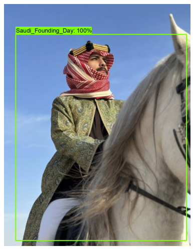
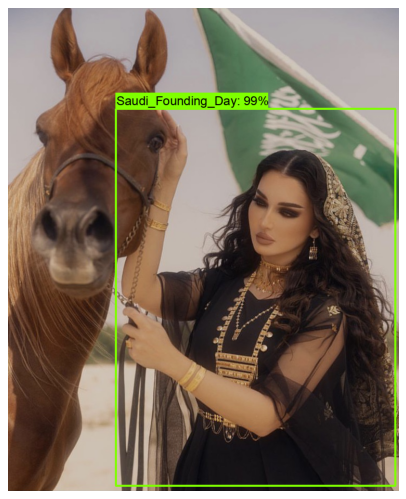
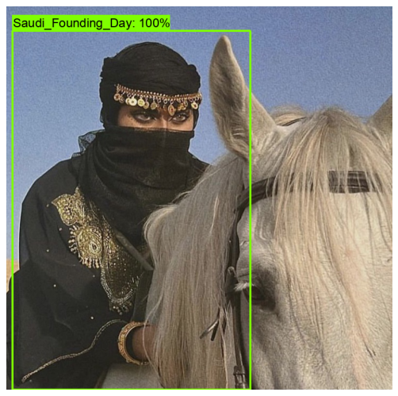
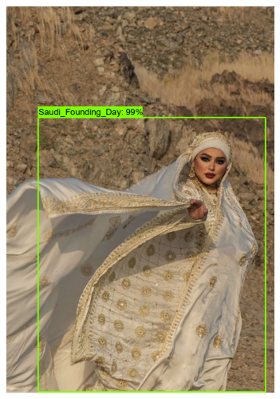
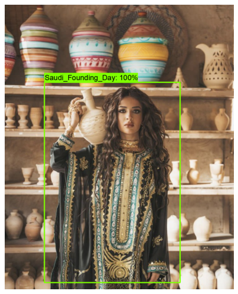
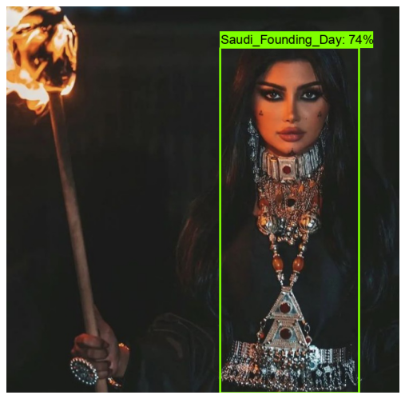
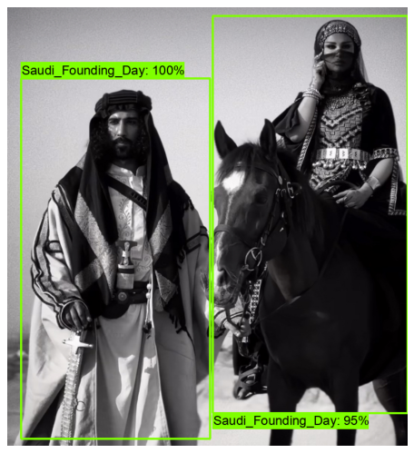
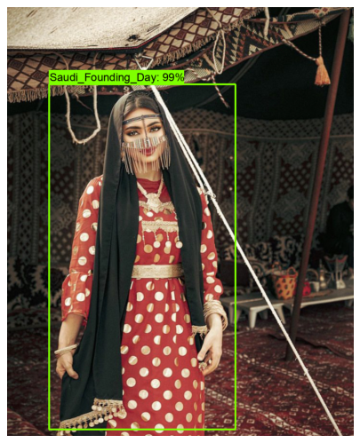
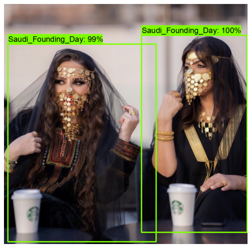

# Saudi Founding Day Object Detection
---------------

This project aims to develop and train a custom object detection model on novel dataset to identify and recognize outfits that represent the Saudi Founding Day. 

In this project, I have trained the Saudi Founding Day outfits detector on Google Colab utilizing its free GPU resources using Tensorflow object detection API version 2.

## Technology and tools used:

* Google Colab

* Python 3.8.10

* TensorFlow 2.11.0

* Tensorflow 2 object detection API

* labelImg

# Project steps/pipline:

* ## 1- Building the dataset (Data preparation)

I collected 500 images that express the outfits for the Saudi Foundation Day, then divided them into 400 images to be fed into the model in the training phase and 100 photos for the testing phase.
 

* ## 2- Annotating the dataset 

To annotate the dataset, I used the LabelImg tool on the train and test images, and labeled each image.
(Note: It took me 3 hours and 30 minutes to finish the annotations process)

* ## 3- Training the model

I trained the custom model using the fine-tuning technique(transfer learning). I chose the pre-trained ``ssd_mobilenet_v2_fpnlite_320x320_coco17`` model checkpoint (that has been trained on the COCO dataset) as a starting point to train my model.

I made the following changes to the model pipeline config file:

* Changed ``num_classes`` to ``num_classes: 1``

* Changed ``fine_tune_checkpoint`` to ``fine_tune_checkpoint: "/content/drive/MyDrive/ saudi-founding-day-object-detection/data/ssd_mobilenet_v2_fpnlite_320x320_coco17_tpu-8/checkpoint/ckpt-0"``

* Changed ``fine_tune_checkpoint_type`` to ``fine_tune_checkpoint_type: "detection"``

* Changed ``batch_size`` to ``batch_size: 24``
(Note: batch_size = 128 and 64 give an error in google colab)

* Changed ``num_steps`` to ``num_steps: 2000``

* Changed ``label_map_path`` to ``label_map_path: "/content/drive/MyDrive/saudi-founding-day-object-detection/data/label_map.pbtxt"``

* Changed ``input_path`` to ``input_path: "/content/drive/MyDrive/saudi-founding-day-object-detection/data/train.record"``

* Changed ``label_map_path`` to ``label_map_path: "/content/drive/MyDrive/saudi-founding-day-object-detection/data/label_map.pbtxt"``

* Changed ``input_path`` to ``input_path: "/content/drive/MyDrive/saudi-founding-day-object-detection/data/test.record"``

(Note: I trained the model on 500 images for 2000 steps thus the training process took 8 hours on google colab)

* ## 4- Monitoring Training with TensorBoard

* ## 5- Testing out the custom trained model

Below are some of the model predictions on images and videos to show the model performance:

https://user-images.githubusercontent.com/42275950/223482139-7719a4bf-8a7b-4c39-9cb0-a60e95b5f251.mp4

https://user-images.githubusercontent.com/42275950/223483809-2844a0d8-3688-4650-a885-3411043c253f.mp4

